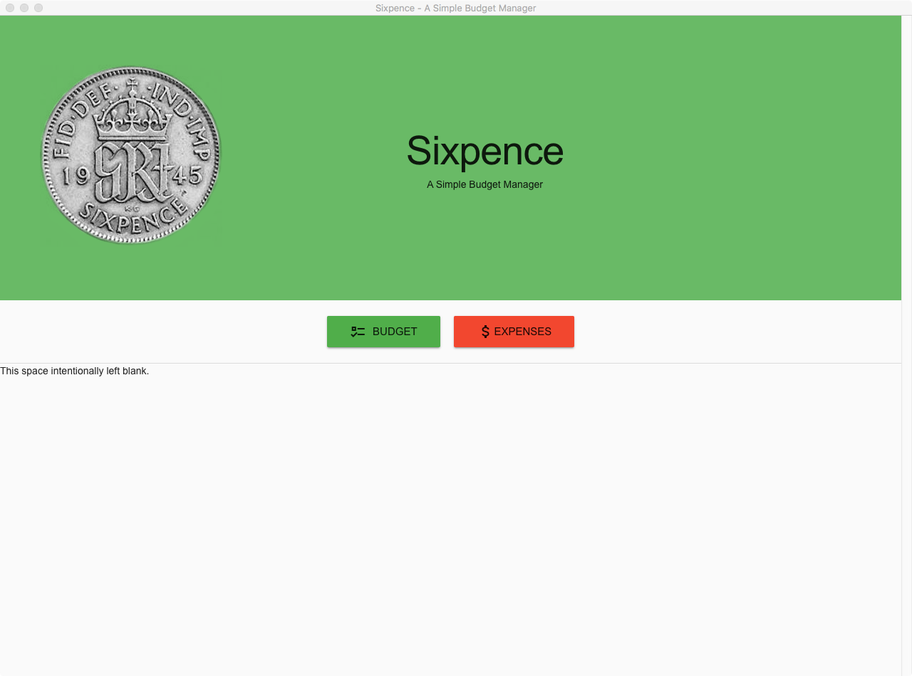
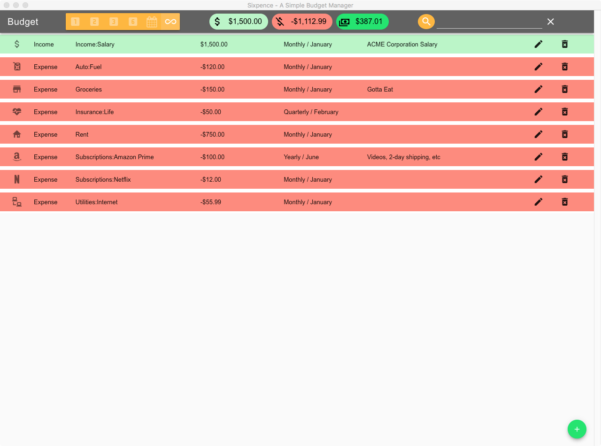
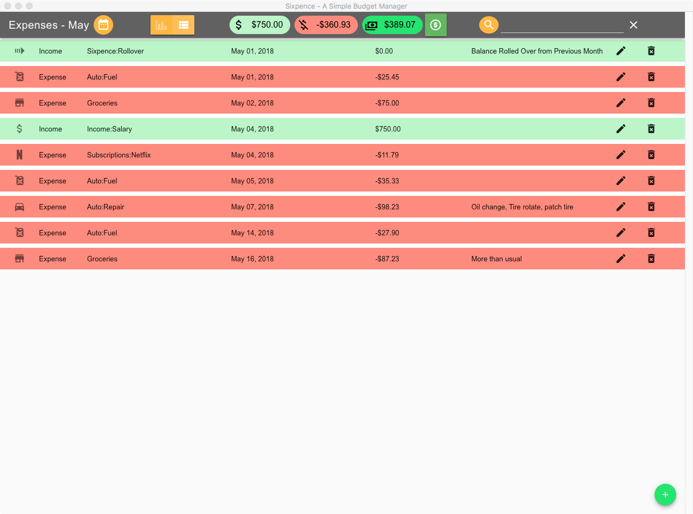

# Sixpence

> A Simple Budget Manager

Sixpence is a cross-platform application built using [Electron][electron],
[Vue.js][vuejs] and [Vuetify][vuetify]. It can be built to run on Linux, Windows
or MacOS.

Sixpence exists because I couldn't find another application to manage my budget
the way **I** wanted to manage my budget. I built it for myself, my use case. But if
it works for you too, then great!

One day I'll get around to writing some docs to explain how it works and the
general philosophy of it's usage. Until then, feel free to download it and try
it out.

Sixpence allows you to create a budget and then track your progress. It is **not**
Quicken or Moneydance or Mint.com. It can be used in conjunction with those kinds
of applications.

## Features
* Create and Maintain a Budget
* Budgeted items can recur Monthly, Bi-Monthly, Quarterly, Bi-Yearly or Yearly
* Track Expenses and progress towards budgeted items
* Automatically tracks un-budgeted income & expenses
* Expense tracking focuses on the current month, but allows you to view/edit previous months.
* Monthly expense tracking takes into account non-monthly budgeted items. E.g. Your yearly subscription for Amazon Prime will show up as an expected (budgeted) expense for the month that it is due. Meaning you'll know that in June you have an extra $99 to shell out that month.
* Quickly and Easily search your Budget or Expenses
* View your expenses as a timeline list
* View your expenses grouped by category showing progress toward each budgeted item.
* Icons to help you quickly identify categories

## Screen Shots (Old Needs Updating)
### Main


### Budget


### Expenses - List (ordered by date)


### Expenses - Grouped by Budget Category - Showing Progress


## Development
### Build Setup

``` bash
# install dependencies
npm install

# serve with hot reload at localhost:9080
npm run dev

# build electron application for production
npm run build

# lint all JS/Vue component files in `src/`
npm run lint

```

-----

This project was generated with [electron-vue](https://github.com/SimulatedGREG/electron-vue)@[1c165f7](https://github.com/SimulatedGREG/electron-vue/tree/1c165f7c5e56edaf48be0fbb70838a1af26bb015) using [vue-cli](https://github.com/vuejs/vue-cli). Documentation about the original structure can be found [here](https://simulatedgreg.gitbooks.io/electron-vue/content/index.html).

[electron]: https://electronjs.org
[vuejs]: https://vuejs.org
[vuetify]: https://vuetifyjs.com
